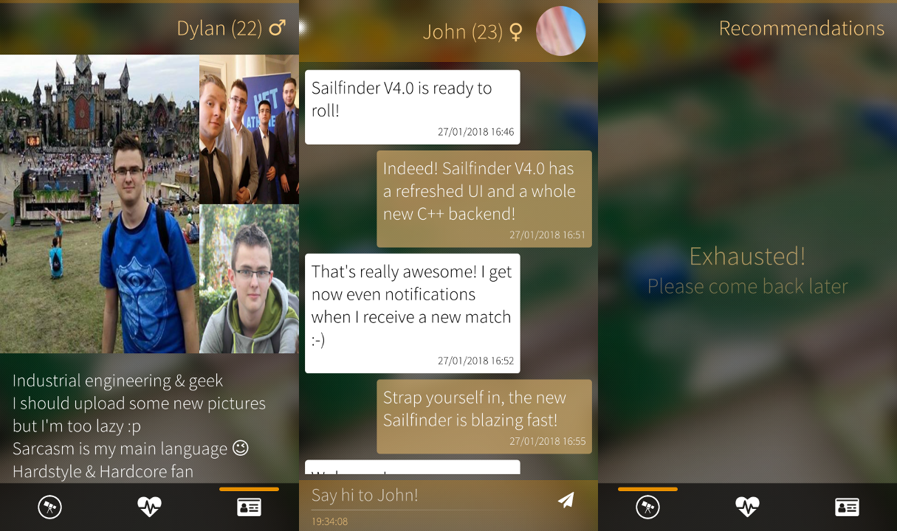

<h1 align="center">
  <br>
  
  <br>
  <br>
  Sailfinder
  <br>
  <br>
</h1>

Sailfinder is an unofficial Tinder client for Sailfish OS.
This unofficial client has almost the same features as the official Android/iOS client.

Sailfinder is available in the official Jolla Store and on [Openrepos.net](https://openrepos.net/content/minitreintje/sailfinder)

## Features
- Like, dislike, superlike people
- View their profile, pictures, bio, ...
- Notifications
- View your matches, send them messages and unmatch them
- GIF support
- Edit your profile: change your search criteria, discoverable, ...
- Modern Sailfish Silica UI and a blazing fast C++ backend

## Translations
You can translate Sailfinder using the Transifex translations service.
In case the language isn't available you can always request it and I will add it.

https://www.transifex.com/dylanvanassche/harbour-sailfinder/

## Powered by
- [Qt5](https://www.qt.io)
- [Transifex](https://www.transifex.com)
- [Sailfish OS](https://www.sailfishos.org)

## Disclaimer
Sailfinder and it's contributors aren't related to Tinder in any way and they can't be hold responsible for anything. You agree automatically with this disclaimer by using the application, contribute to it, ...

## Screenshots



## Build instructions
- Clone this repository
- Fire up QtCreator (SailfishSDK)
- Open the `.pro` file and add your build targets
- Create a header file in `./src` called `keys.h` with the GIPHY API key: ```#define GIPHY_KEY "yourapikey"``` 
